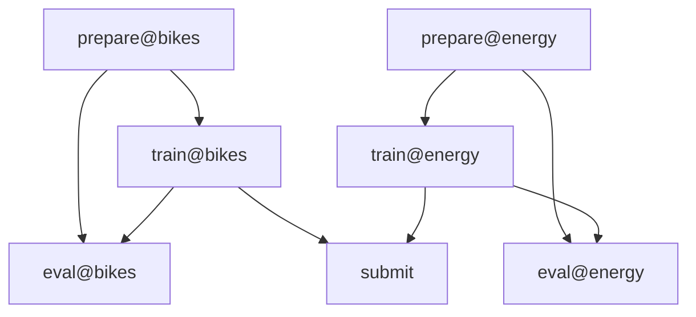

# Probabilistic Timeseries Forecasting Challenge


[][pre-commit]


[pre-commit]: https://github.com/pre-commit/pre-commit

Repository for the Probabilistic Timeseries Forecasting Challenge. This challenge focuses on quantile forecasting for timeseries data in Germany and Karlsruhe. Results can be found [here](https://gitlab.kit.edu/nils.koster/ptsfc24_results) and are visualized [here](https://jobrac.shinyapps.io/ptsfc24_viz/).

Forecasts are inherently uncertain, and it is important to quantify this uncertainty. The goal is to predict some kind of distribution of future values, rather than just a single point estimate. Quantiles are a relatively straightforward way to quantify such an uncertainty.
The challenge is based on two datasets: `bikes` and `energy`. A third dataset `no2` is also available, but was not selected for forecast submissions.

DVC tracked parameters, as well as metrics and plots can be found on [DVC Studio](https://studio.dvc.ai/user/MoritzM00/projects/proba-forecasting-jclqxio6ht).


## Quickstart

First, clone the repository:

```shell
git clone https://github.com/MoritzM00/proba-forecasting
cd proba-forecasting
```

Then follow the instructions [here](#set-up-the-environment) to set up a dev environment.

Finally, reproduce the results by running:

```shell
dvc repro
```

To delete the cache files (`*.sqlite`), that are created by the pipeline, run:

```shell
make submit
```

This will delete the files that store the API calls to openMeteo and the data itself, thus updating the data and then force a pipeline reproduction, e.g. to make a submission in a new forecasting week.

## Data Pipeline

The data pipeline is fully automated using [DVC](https://dvc.org/)'s data and experiment versioning, as well as caching and remote storage capabilities.
The pipeline can be visualized using `dvc dag`, or via the web using the [project's DagsHub location](https://dagshub.com/MoritzM00/proba-forecasting):



The pipeline consists of four stages:

1. `prepare`: Downloads and preprocesses the data.
2. `train`: Train and save the models.
3. `eval`: Evaluate the models using Timeseries Cross-validation with expanding time windows.
4. `submit`: Create out-of-sample forecasts in the required format for this forecasting challenge.

Stages 1-3 are run for two datasets: `bikes` and `energy`.

The image below shows an example run of the pipeline, showcasing the automatic caching capabilities of DVC. Therefore, only the stages that have changed since the last run are executed.


## Repository Structure

The following is the structure of the repository:

```shell
proba-forecasting
├── data # DVC managed data directory
├── models # stores the trained models in .pkl, dvc managed
├── notebooks # used for development
├── output # dvc managed output directory, contains all artifacts created by the pipeline
├── scripts
├── src
│   └── probafcst
│       ├── metrics
│       ├── models # defines all models using sktime interface
│       ├── pipeline # defines the data pipeline scripts used by dvc.yaml
│       ├── utils # utils such as tabularization, checking etc.
│       ├── __init__.py
│       ├── backtest.py # implements TSCV with sktime
│       ├── data.py # data fetching
│       ├── plotting.py
│       └── weather.py
├── tests
├── LICENSE
├── Makefile
├── README.md
├── dvc.lock
├── dvc.yaml # Pipeline definition in yaml
├── params.yaml # defines parameters
├── pyproject.toml
└── uv.lock
```

## Development Guide

This guide shows how to reproduce the results of the challenge.

### Set up the environment

1. Install [uv](https://docs.astral.sh/uv/getting-started/installation/)
2. Set up the environment:

```bash
make setup
source .venv/bin/activate
```

### Reproduce the results

After setting up and activating the environment, run:

```shell
dvc repro
```

to reproduce the results.

### Documentation

The Documentation is automatically deployed to GitHub Pages.

To view the documentation locally, run:

```bash
make docs_view
```

## Credits

This project was generated with the [Light-weight Python Template](https://github.com/MoritzM00/python-template) by Moritz Mistol.
